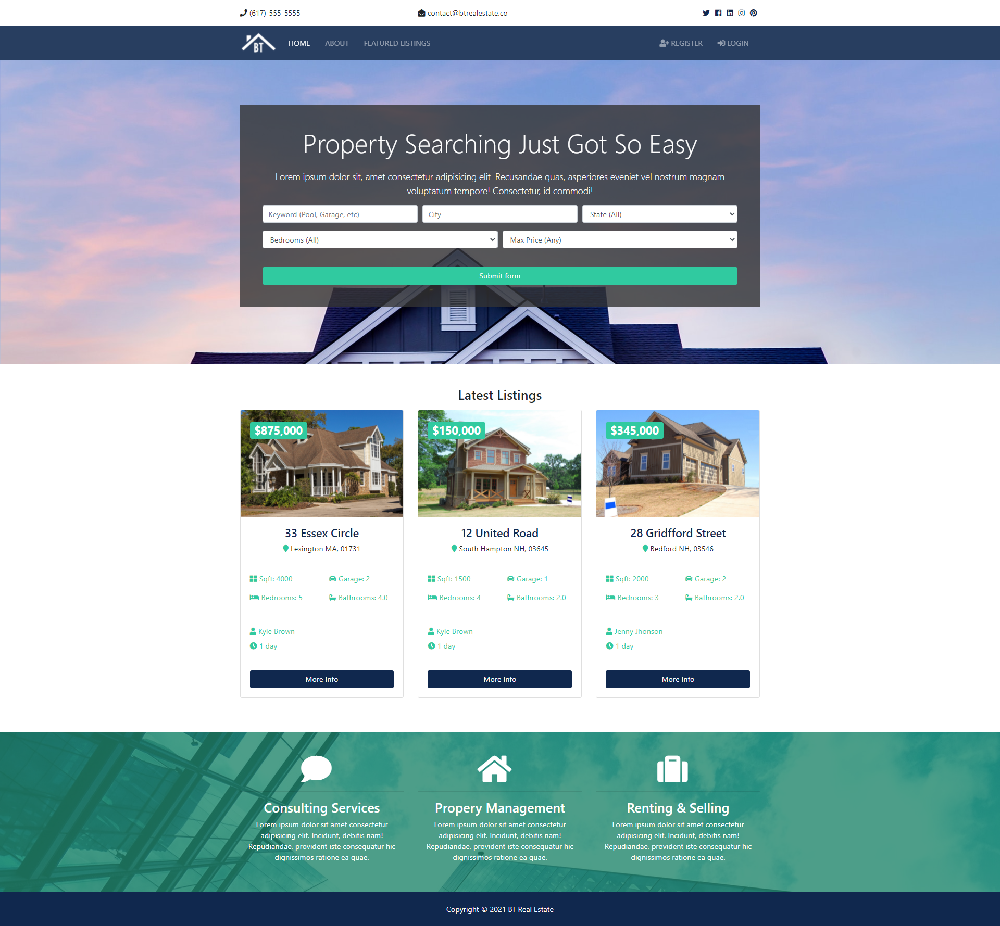
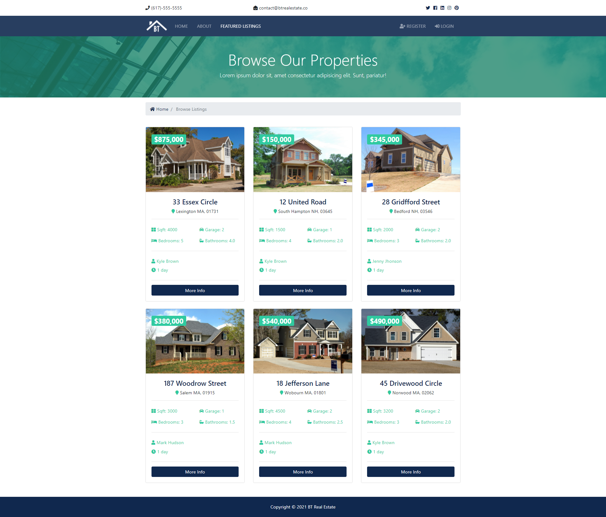
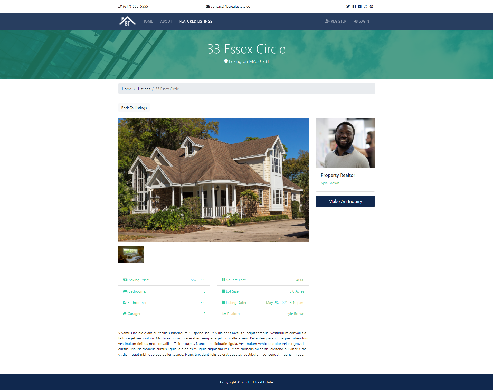
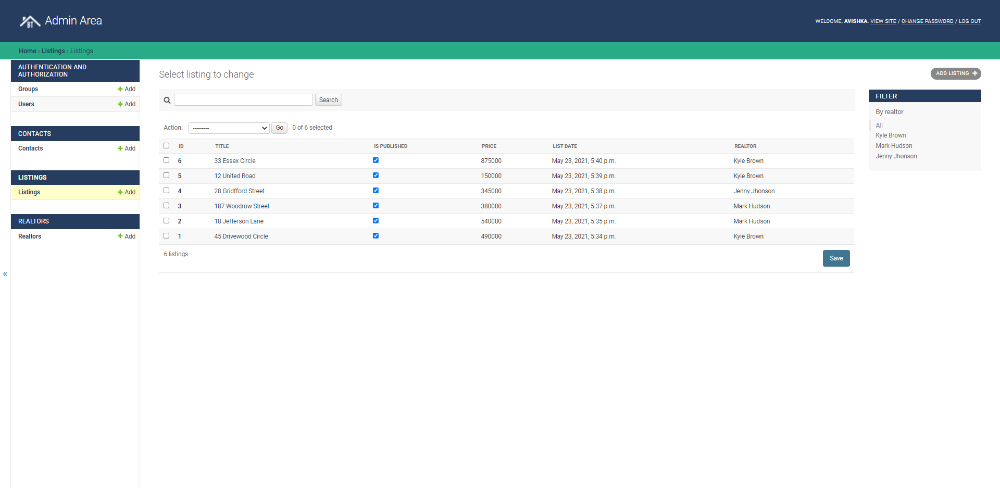

# BT Real Estate Web App :house_with_garden:

This is a web app designed for a real estate company to showcase their listings. [Django](https://www.djangoproject.com/) was used for the development with PostgreSQL. You can visit the web app from [HERE](http://167.172.155.174/)

## Screenshots :camera:

#### Home Page



#### Listings Page



#### Single Listing Page



#### Admin Panel



## Setup Guide :raised_hands:

### Python Environment Setup 

Make sure you have python 3.6 or newer installed on your computer. If so, clone this repository to your local computer.

```bash
$ git clone https://github.com/Avishka-Shamendra/real-estate-project.git
$ cd real-estate-project
```

Then create a virtual environment to run the project in. The commands may change depending on the operating system you are using. For windows,

```bash
$ python -m venv venv
$ .\venv\Scripts\activate.bat
```

Then install dependencies needed in the virtual environment

```bash
(venv) pip install -r requirements.txt 
```

Check if following command prints the available command. If the installation is successful, this should not cause an error.

```bash
(venv) python manage.py
```

### Postgres Setup

Install [PostgreSQL](https://www.postgresql.org/) in the local machine and setup correctly. Use the following command to log in to the `psql` shell as `postgres` user.

```bash
$ psql -U postgres
```
Then create a new database and exit the `psql` shell

```bash
(psql) CREATE DATABASE btredb;
(psql) \q
```
### Django Setup

First, run the database migration and create the necessary tables. Make sure you are in the correct virtual environment. Whenever there is a database model change, you should re-run this.

```bash
(venv) python manage.py migrate
```
Then create the static files required for the project.

```bash
(venv) python manage.py collectstatic
```

Finally, create the admin user account. This will be the default admin user for the system. Give a preferred username and password.

```bash
(venv) python manage.py createsuperuser
```
Afterward, try running the project. The default URL for the admin is <http://127.0.0.1:8000/admin>

```bash
(venv) python manage.py runserver
```
